<!--
**Ndzull/Ndzull** is a ✨ _special_ ✨ repository because its `README.md` (this file) appears on your GitHub profile.

Here are some ideas to get you started:

- 🔭 I’m currently working on ...
- 🌱 I’m currently learning ...
- 👯 I’m looking to collaborate on ...
- 🤔 I’m looking for help with ...
- 💬 Ask me about ...
- 📫 How to reach me: ...
- 😄 Pronouns: ...
- ⚡ Fun fact: ...
-->
## Hello, World!
I'm Ijul, currently working as a Full-Time Learner XD and there is my workspace!
- 👀 Currently interest and learning about datsci
- 👾 Had a opportunity to learn robot program w/@IRIS ITS
- 💬 Open to discuss and collaborate
- 📸 Likes to make content etc.
- 📨 Lets connect! @naiidzull_ on insta or Naila Dzulfa at Linkedin :D
<!---->
